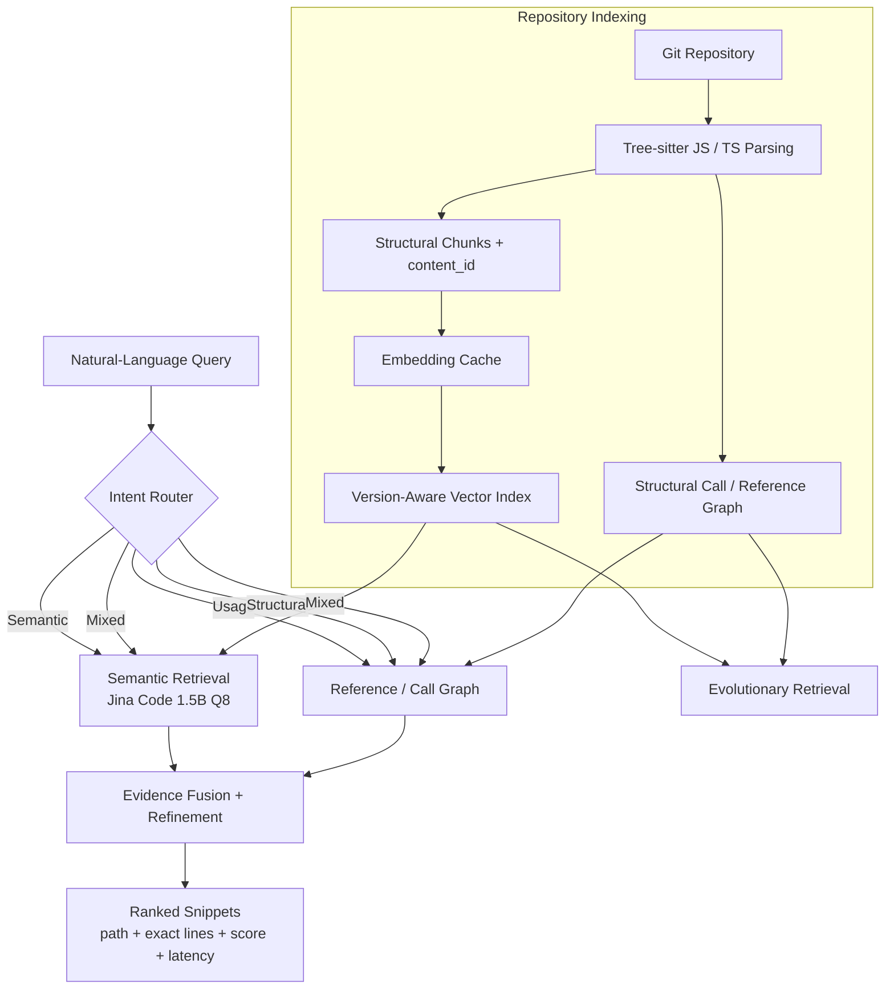

# Agentic Code Intelligence  
### Samsung PRISM Generative AI Hackathon 3.0 · Theme 1

> **CPU-first, version-aware code retrieval for large repositories.**  
> Ask a natural-language question, retrieve the most relevant code snippets with exact file/line locations, search across Git versions, and inspect how code evolves over time.

[](https://www.python.org/)
[](https://fastapi.tiangolo.com/)
[](https://react.dev/)
[](https://mteb.readthedocs.io/)


---

## Demo & Submission Links

- **Demo video:** [YouTube demo](https://www.youtube.com/watch?v=dpuXl0uI-rU)
- **Presentation / PPT PDF:** [Google Drive PDF](https://drive.google.com/file/d/1iUm7iALrto8NiXr2GRipvPFWBasBJFvC/view?usp=sharing)
- **Official AppsRetrieval submission artifact:** [`submission/appsretrieval_results.json`](submission/appsretrieval_results.json)
- **Submission checklist:** [README submission checklist](#submission-checklist)

---

## Overview

**Agentic Code Intelligence** is a retrieval system built for the Samsung PRISM Theme 1 problem statement: given a natural-language query and a large codebase, **rank the most relevant code snippets**.

The system goes beyond a single dense-vector lookup by combining:

- **Jina Code 1.5B Q8 embeddings** for semantic code retrieval
- **Tree-sitter AST parsing** for JavaScript/TypeScript structure
- **Call/reference graph evidence** for usage and structural queries
- **Agentic query routing** across semantic, usage, structural and mixed intents
- **Exact source locations** (`path:start_line-end_line`)
- **Content-addressed caches and incremental indexing** across Git versions
- **Evolutionary retrieval** that groups identical code states across history
- **CPU-only execution** through `llama.cpp`
- A **judge-facing React UI** where arbitrary code queries can be entered live

The retrieval pipeline returns **code snippets and locations** rather than generating a long answer, keeping the system aligned with the hackathon's retrieval-first scope.

---

## Samsung Submission Goals

| Goal | Requirement | What this project implements |
|---|---|---|
| **P0 — Retrieval Accuracy** | Retrieve the relevant code snippets for a natural-language query | Jina Code 1.5B Q8 retrieval evaluated through the official MTEB `AppsRetrieval` task |
| **P1 — Retrieval Across Versions** | Support retrieval for different versions and update indexes/caches in reasonable time | Git-aware manifests, content IDs, embedding reuse, incremental vector updates and commit-isolated retrieval |
| **Bonus — Evolutionary Retrieval** | Search code across versions despite highly similar neighboring states | Semantic-state grouping, evolution chains, predecessor/successor tracking, added/modified/deleted/reintroduced states |

---

## Verified Results

### Official P0 — CoIR `AppsRetrieval`

The final screening result is generated through the official MTEB evaluation flow.

| Metric | Result |
|---|---:|
| **NDCG@10** | **0.86950** |
| **MRR@10** | **0.84141** |
| HitRate@10 | 95.56% |
| Recall@100 | 99.10% |

**Evaluation details**

- MTEB task: `AppsRetrieval`
- Evaluation split: `test`
- Test queries: **3,765**
- Corpus candidates: **8,765**
- Submission artifact: `submission/appsretrieval_results.json`

The official Samsung submission JSON is produced using `task_result.to_dict()` from MTEB.

---

### P1 — Version-Aware Retrieval

Real Git-history validation demonstrated that unchanged code can be reused instead of recomputed after every commit.

| Metric | Result |
|---|---:|
| Average embedding reuse | **86.83%** |
| Embedding work saved | **96.42%** |
| Measured incremental speedup | **up to 15.54×** |
| Retrieval parity vs clean rebuild | **PASS** |

> The speedup is a measured benchmark result on the repository used for P1 validation; it is not claimed as a universal speedup for every repository.

---

### Bonus — Evolutionary Retrieval

Internal evolutionary validation compares naive per-commit retrieval with grouped semantic-state retrieval.

| Metric | Raw occurrence search | Evolution-aware search |
|---|---:|---:|
| HitRate@1 | 0.1667 | 0.1667 |
| HitRate@3 | 0.5000 | 0.5000 |
| HitRate@5 | 0.5000 | **0.6667** |
| MRR | 0.2778 | **0.3667** |
| Duplicate top-5 results | 15 | **0** |

> These are **internal validation metrics**, not official Samsung screening metrics.

---

## What Makes the System Different

### 1. Agentic Query Routing

Every query is classified into one of four retrieval modes:

- `semantic`
- `usage`
- `structural`
- `mixed`

The controller then executes only the useful retrieval stages.

```text
Natural-language query
        ↓
Query classification
        ↓
Retrieval planning
        ↓
Semantic and/or structural search
        ↓
Candidate read + refinement
        ↓
Deduplication + ranking
        ↓
Ranked snippets + exact locations + timings
```

The UI displays a **judge-safe action trace** such as:

```text
Classify → Semantic
Semantic search → 30 candidates
Read → 8 code regions
Refine → 12 candidates
Rank → Top 10 snippets
```

This is execution metadata only; hidden model reasoning is not exposed.

---

### 2. Hybrid Semantic + Structural Retrieval

The hands-on retrieval layer combines two complementary signals.

**Semantic retrieval**

- Jina Code 1.5B Q8
- NL-to-code query/passage instructions
- last-token pooling
- normalized embeddings
- exact NumPy dot-product search
- in-memory embedding cache

**Structural retrieval**

- Tree-sitter JavaScript/TypeScript AST
- symbols and enclosing symbols
- imports / exports
- function calls
- identifier references
- persistent call/reference graph
- static source-order evidence

This allows the same interface to answer very different code-search intents.

```text
"How is a payload signed?"
→ semantic retrieval

"Where is openBluetoothSettings used?"
→ reference / usage retrieval

"Which functions call validate before save?"
→ structural source-order retrieval
```

---

### 3. Exact Evidence, Not Just Similarity Scores

Every hands-on result can include:

```text
rank
relevance score
symbol
symbol type
relative file path
start line
end line
commit
code snippet
evidence type
query latency
```

Example:

```text
#1  createSignature
src/signer.js:9-12
Evidence: Semantic
Score: 0.91
```

Structural results additionally expose the evidence that caused the match.

---

### 4. Version-Aware Indexing

The P1 pipeline is content-addressed.

```text
Git repository
      ↓
File manifest
      ↓
Structural chunks
      ↓
content_id
      ↓
Embedding cache
      ↓
Version-aware vector index
```

If a code chunk is unchanged between commits, its embedding is reused.

The system tracks:

- added files/chunks
- modified files/chunks
- deleted files/chunks
- unchanged content
- commit-specific active occurrences
- reusable content-addressed vectors

This avoids blindly rebuilding the entire retrieval index after every commit.

---

### 5. Evolutionary Retrieval

Searching every commit independently creates duplicate results because unchanged functions may appear in many commits.

This project groups equivalent versions by `content_id`.

```text
State A
  commits: A, B, C
        ↓ modified
State B
  commits: D, E
        ↓ deleted
State C
  reintroduced at commit F
```

Evolution results may include:

- first-seen commit
- last-seen commit
- occurrence commits
- predecessor state
- successor state
- lines added
- lines removed
- semantic score

---

## Supported Hands-On Queries

The judge-facing UI accepts arbitrary natural-language **code retrieval** queries against an indexed repository.

### Semantic

```text
How is the input transformed before it is sent to the API?
```

### Usage / Reference

```text
Where is openBluetoothSettings used?
```

### Structural

```text
Which functions call validate before save?
```

Structural call order is reported as **static source-order evidence**, not guaranteed runtime execution order.

### Mixed

```text
Where is the SHA1 signer used before serialization?
```

### Across Versions

Run the same query against different commits and compare the ranked snippets.

### Across History

Search distinct semantic states of code across repository history.

---

## Architecture



---

## Technology Stack

| Layer | Technology |
|---|---|
| Code embeddings | Jina Code 1.5B Q8 GGUF |
| Embedding runtime | `llama.cpp` |
| Benchmark framework | MTEB |
| Structural parsing | Tree-sitter |
| Vector search | NumPy exact dot product |
| API | FastAPI + Pydantic + Uvicorn |
| Versioning | Git + deterministic manifests/content IDs |
| Persistent metadata | JSON / NumPy artifacts |
| Frontend | React + Vite + TypeScript + Tailwind CSS |
| Primary hands-on structural languages | JavaScript / JSX / TypeScript / TSX |
| Compute target | CPU-first |

---

# Quick Start

## 1. Clone

```powershell
git clone https://github.com/samriddhitiwary/Samsung_Agentic_AI.git
cd Samsung_Agentic_AI
```

## 2. Python environment

Python **3.11** is recommended.

```powershell
py -3.11 -m venv .venv
.\.venv\Scripts\Activate.ps1
python -m pip install --upgrade pip
python -m pip install -r requirements.txt
```

If PowerShell activation is restricted, use the virtual environment interpreter directly:

```powershell
.\.venv\Scripts\python.exe -m pip install -r requirements.txt
```

---

## 3. Configure llama.cpp

The retrieval model is served locally using `llama-server`.

Set the executable path:

```powershell
$env:JCR_LLAMA_CPP_EXECUTABLE = "C:\path\to\llama-server.exe"
```

Expected model:

```text
data/cache/model_files/jina-code-embeddings-1.5b-Q8_0.gguf
```

Start the embedding server:

```powershell
& $env:JCR_LLAMA_CPP_EXECUTABLE `
  --embedding `
  --model data\cache\model_files\jina-code-embeddings-1.5b-Q8_0.gguf `
  --host 127.0.0.1 `
  --port 8081 `
  --ctx-size 2048 `
  --ubatch-size 512 `
  --pooling last `
  --parallel 1 `
  --device none `
  --gpu-layers 0 `
  --no-op-offload
```

Health endpoint:

```text
http://127.0.0.1:8081/health
```

---

## 4. Start the API

Open a second terminal:

```powershell
.\.venv\Scripts\python.exe -m uvicorn src.api.app:app --host 127.0.0.1 --port 8000
```

Check:

```powershell
Invoke-RestMethod http://127.0.0.1:8000/health
```

API:

```text
http://127.0.0.1:8000
```

---

## 5. Start the frontend

Open a third terminal:

```powershell
cd frontend
npm install
npm run dev
```

Open:

```text
http://127.0.0.1:5173
```

The main screen is the actual retrieval console.

A judge can select an indexed repository/version, enter an arbitrary code query and inspect the returned snippets, exact locations, evidence and runtime.

---

# Index a Repository

Repositories can be registered from the frontend or directly through the API.

```powershell
$body = @{
    repo_path = "C:\path\to\javascript-repository"
    repo_id   = "sample_repo"
    commit    = "HEAD"
} | ConvertTo-Json

Invoke-RestMethod `
    -Uri http://127.0.0.1:8000/repos/register `
    -Method Post `
    -ContentType "application/json" `
    -Body $body
```

Registration reports information such as:

- source files
- symbols
- chunks
- call edges
- reference edges
- embedding reuse / generation
- indexing runtime

---

# Run an Arbitrary Query

```powershell
$body = @{
    repo_id = "sample_repo"
    query   = "Where is openBluetoothSettings used?"
    top_k   = 10
} | ConvertTo-Json

Invoke-RestMethod `
    -Uri http://127.0.0.1:8000/query `
    -Method Post `
    -ContentType "application/json" `
    -Body $body
```

The response contains:

- query type
- execution trace
- real timing fields
- ranked snippets
- exact path and line ranges
- evidence type

---

# P1 — Update to Another Commit

```powershell
$body = @{
    commit = "<TARGET_COMMIT>"
} | ConvertTo-Json

Invoke-RestMethod `
    -Uri http://127.0.0.1:8000/repos/sample_repo/update `
    -Method Post `
    -ContentType "application/json" `
    -Body $body
```

The update response reports changed files, chunk reuse, embeddings reused/generated and update runtime.

After the update, queries can immediately be run against the newly indexed commit.

---

# Bonus — Search Across History

```powershell
$body = @{
    repo_id = "sample_repo"
    query   = "serializer signing"
    top_k   = 5
    include_evolution_context = $true
} | ConvertTo-Json

Invoke-RestMethod `
    -Uri http://127.0.0.1:8000/search/evolution `
    -Method Post `
    -ContentType "application/json" `
    -Body $body
```

Evolutionary retrieval returns distinct code states instead of repeating unchanged code from every commit.

---

# API Summary

| Method | Endpoint | Purpose |
|---|---|---|
| `GET` | `/health` | Service/model/index health |
| `POST` | `/repos/register` | Index a local Git repository |
| `POST` | `/repos/{repo_id}/update` | Incrementally update to another commit |
| `POST` | `/query` | Unified arbitrary-query retrieval |
| `POST` | `/search` | Version-specific semantic search |
| `POST` | `/search/evolution` | Search semantic states across history |
| `GET` | `/repos/{repo_id}/symbols/evolution` | Inspect symbol evolution |
| `GET` | `/metrics/summary` | Load frozen P0/P1/Bonus evidence |

---

# Official Samsung P0 Submission

The official Samsung screening artifact is generated using the required MTEB flow.

```powershell
.\.venv\Scripts\python.exe scripts\run_samsung_mteb_submission.py --require-cache
```

The runner executes:

```python
task = mteb.get_task("AppsRetrieval")

result = mteb.evaluate(
    model,
    [task],
    encode_kwargs={"batch_size": 4},
)

task_result = list(result.task_results)[0]
```

Output:

```text
submission/appsretrieval_results.json
```

Expected frozen metrics:

```text
NDCG@10 = 0.86950
MRR@10  = 0.8414101267
```

For submission, attach `appsretrieval_results.json` to the GitHub Release.

---

## Validation

### Compile

```powershell
python -m compileall src scripts
```

### API integration

```powershell
.\.venv\Scripts\python.exe scripts\verify_api.py
```

### Hands-on JavaScript validation

```powershell
.\.venv\Scripts\python.exe scripts\validate_hands_on_js.py
```

### Optional warm-up before demo

```powershell
.\.venv\Scripts\python.exe scripts\warmup_demo.py --repo-id <REGISTERED_REPO_ID>
```

Warm-up loads runtime state; it does **not** preload final answers.

### Frontend production build

```powershell
cd frontend
npm install
npm run build
```

---

## Repository Structure

```text
Samsung_Agentic_AI/
│
├── configs/                   # Runtime/model configuration
├── data/
│   ├── api/                   # Hands-on validation/performance reports
│   ├── cache/                 # Embedding/model caches
│   └── versioning/            # Version manifests, indexes and P1 reports
│
├── docs/                      # Architecture and project documentation
├── frontend/                  # React judge-facing retrieval console
├── results/                   # Frozen retrieval benchmark results
├── scripts/
│   ├── run_samsung_mteb_submission.py
│   ├── verify_api.py
│   ├── demo_system.py
│   ├── validate_hands_on_js.py
│   ├── benchmark_hands_on_repo.py
│   └── warmup_demo.py
│
├── src/
│   ├── agentic/               # Query routing + retrieval controller
│   ├── api/                   # FastAPI service
│   ├── retrieval/             # P0 retrieval implementations
│   ├── structure/             # Tree-sitter + structural graph
│   └── versioning/            # P1 and evolutionary retrieval
│
├── submission/
│   └── appsretrieval_results.json
│
├── requirements.txt
└── README.md
```

---

## Performance Notes

The system is intentionally **CPU-first**.

The largest recurring cost for unseen semantic queries is generating the query embedding with Jina Code 1.5B Q8. To keep interactive retrieval responsive, the hands-on path uses:

- persistent HTTP connections
- in-memory bounded query-embedding cache
- in-memory vector/graph state
- structural fast paths for exact reference/call queries
- candidate deduplication
- incremental content-addressed caches

Usage and structural queries can skip semantic embedding when deterministic structural evidence is already sufficient.

---

## Scope and Limitations

- Official P0 scoring is based on **CoIR `AppsRetrieval`**; internal hands-on metrics are kept separate.
- JavaScript/TypeScript structural reasoning is based on static parsing and graph evidence.
- Call order currently represents **static source order**, not guaranteed runtime execution order.
- Dynamic JavaScript behavior may prevent exact static symbol resolution in some cases.
- The official Samsung sample JavaScript repository was not available locally during development; internal hands-on repositories are therefore clearly identified as engineering validation data.
- No generated natural-language answer is required for the core retrieval workflow: results are ranked code snippets and locations.
- Optimization suggestions are intentionally not part of the core retrieval ranking path.

---

## Submission Checklist

- [x] Working prototype
- [x] Public GitHub repository
- [x] Reproducible setup instructions
- [x] Official `AppsRetrieval` MTEB evaluation
- [x] `submission/appsretrieval_results.json`
- [x] P1 retrieval across versions
- [x] Bonus evolutionary retrieval
- [x] Judge-facing arbitrary-query frontend
- [x] CPU-local inference
- [x] Demo video link added to README
- [x] Final PPT/PDF link added to README
- [x] Hands-on demo workflow documented
- [x] Frozen P0/P1/Bonus artifacts preserved
- [x] Final GitHub repository link documented
- [ ] Final GitHub Release attachment, if required by the submission portal

---

## Demo Video and Presentation

- **Demo video:** [YouTube demo](https://www.youtube.com/watch?v=dpuXl0uI-rU)
- **Presentation / PPT PDF:** [Google Drive PDF](https://drive.google.com/file/d/1iUm7iALrto8NiXr2GRipvPFWBasBJFvC/view?usp=sharing)

The demo is intended to show:

1. an arbitrary judge-entered query,
2. ranked snippets with exact file/line locations,
3. real retrieval latency,
4. a usage or structural query,
5. version-aware update/search,
6. evolutionary retrieval across history.

---

## Team

**Samsung PRISM Generative AI Hackathon — Theme 1: Agentic Code Intelligence**

**Samriddhi Tiwary**  
VIT Vellore  
Email: `samriddhi.tiwary2023@vitstudent.ac.in`

Repository:  
`https://github.com/samriddhitiwary/Samsung_Agentic_AI`

---

## Acknowledgement

Built for the **Samsung PRISM Generative AI Hackathon 3rd Edition — Theme 1: Agentic Code Intelligence**.

The project is intentionally focused on **retrieval quality, version-aware indexing, evolutionary search, reproducibility and CPU-efficient execution**.
